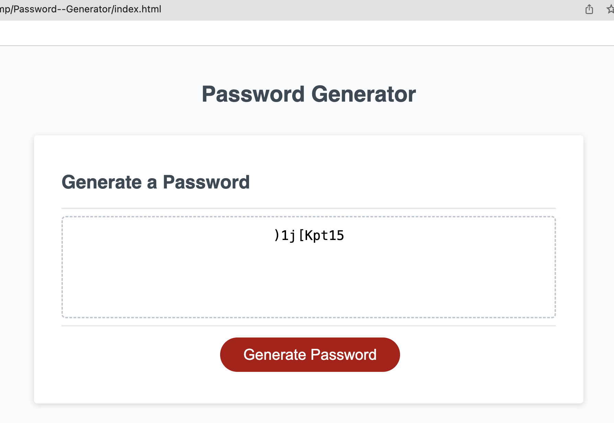

# Password--Generator

Application that an employee can use to generate a random password

# Description

In this challenge I used the Java Script language to create code that an employee can use to generate a random password based on criteria they’ve selected.
The user generates the password when the button is clicked and answered the following questions:
  * Would you like Lower Case characters?
  * Would you Upper Case characters?
  * Would you like numbers?
  * Would you like Special Characters?

   Once prompts are answered the password is generated and showed on the page.
  If the user does not meet the requirements to be able to enter the password then the system will skip generation of the password.

 ## Table content

 During this project I worked with the following:

- [GitHub](#github)
- [JavaScript](#javascript)

## GitHub 

I created a new GitHub repo called  `Password--Generator`, like it was instructed. Then cloned it to my computer. Copied the starter files in my local git repository and added images. 

## JavaScript

 I used JavaScript language to create my cod and worked with :
 - variables
 - loop like:
     - `for` (to run the code over and over again, each time with a different value).
 - conditional 
     - `if` ( to perform different actions based on different conditions).
 - metodhs like : 
     - `alert` (to display the result).
     - `prompt` (to displays a dialog box that prompts the user for input.).
     - `push` (to adds new items to the end of an array).
     - `include` (to returns true if a string contains a specified string).
     - `Math.floor` / `Math.random` (to find random index from a given array).

## Expected result

## Result of project
 
 
 
 
 
 
 
 

## URL

* The URL of the deployed application.

https://alinakristy.github.io/Password--Generator/

* The URL of the GitHub repository. 

https://github.com/alinakristy/Password--Generator 
